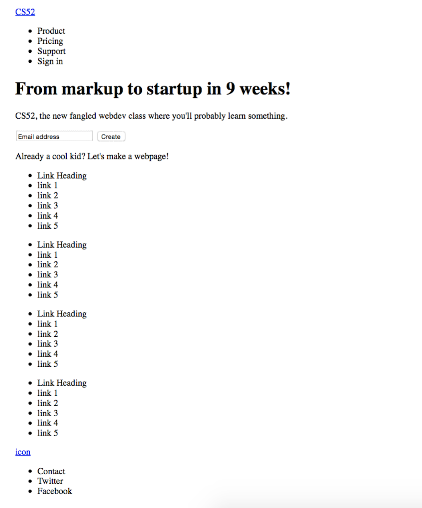
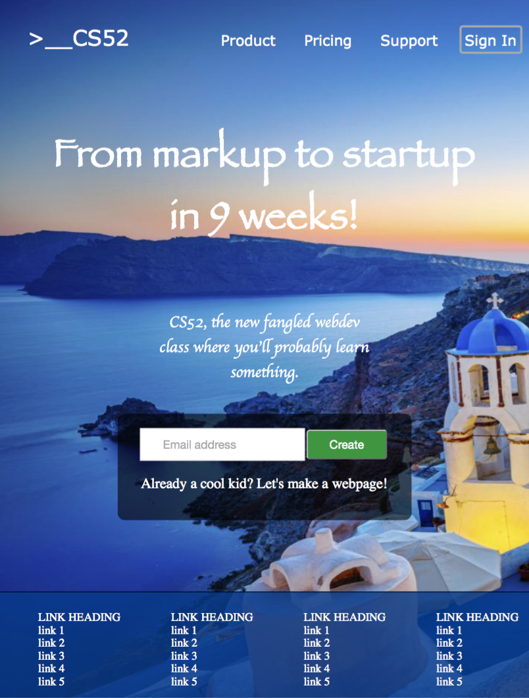
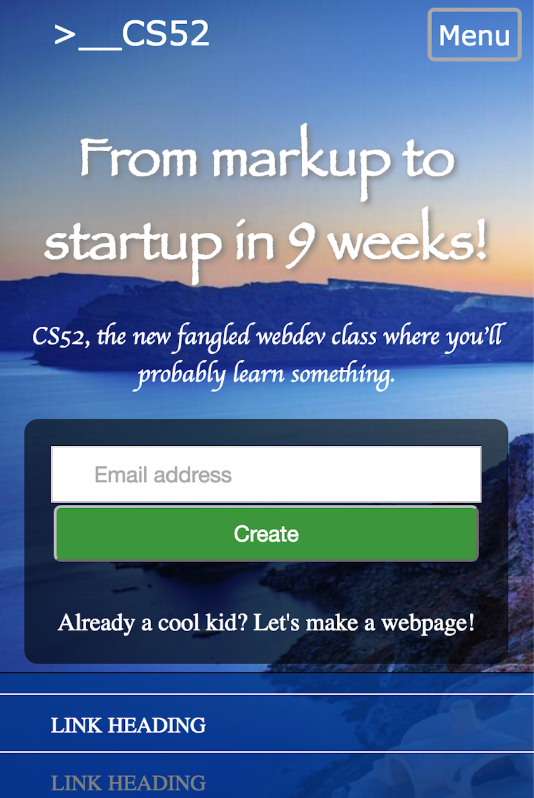
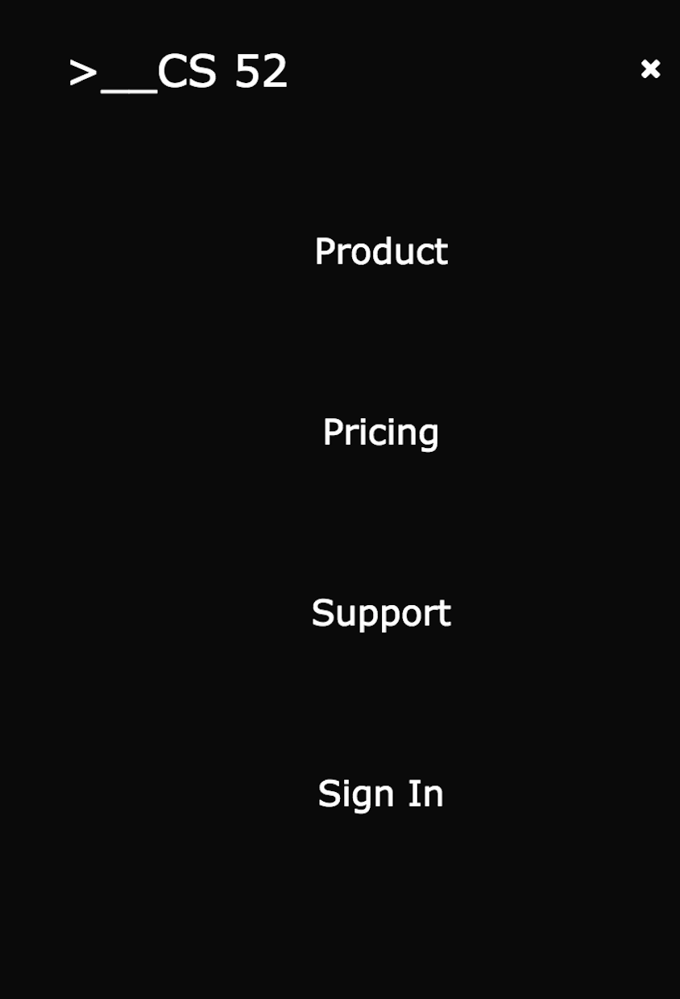

### README FOR CS52 LAB1
#### Author: Xinwei Jiang
#### Date: July 4, 2016

##### I created a webpage that is similar to slack.com

##### What I did:

- display all elements from the original site
- use only pure CSS/HTML
- use mostly flexboxes for layout
- be responsive with 1 narrow phone friendly version per original
- include some details such as hover effects and border-radius

##### What I did for Extra Credit:

- CSS transition
- CSS Checkbox Hack for the mobile version Menu

##### Here are the screen caps:

